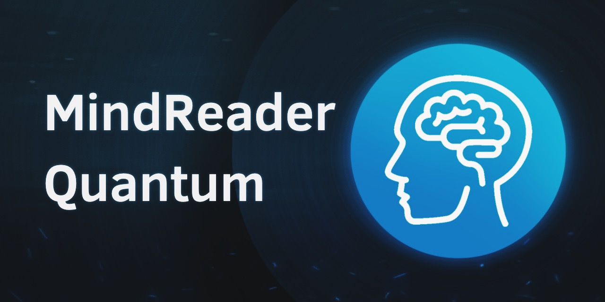

# MindReader Quantum



## Introduction

Welcome to the MindReader Quantum Mobile App! Originally created for the 2023 MIT iQuHack hackathon, this application leverages quantum-computing technology to help users determine stages of dementia using MRI images. Built with Flask, Expo, React Native, and powered by a Python backend, this app utilizes a Hybrid Classification Model that employs Classical-to-Quantum transfer learning for improved accuracy.

## Features

- **MRI Image Upload**: Users can upload MRI images directly from their mobile devices.

- **Hybrid Model**: The app utilizes a Hybrid Model that combines classical machine learning with quantum computing techniques for improved image classification.

- **Stage Detection**: The app provides a clear and detailed report on the detected stage of dementia, including relevant medical information.

- **User-Friendly Interface**: A user-friendly and intuitive interface ensures easy navigation and a seamless user experience.

## Technologies Used

- **Frontend**:
  - React Native: A popular framework for building mobile applications with a native look and feel.
  - Expo: A set of tools and services for building React Native apps more quickly and easily.

- **Backend**:
  - Flask: A lightweight web framework for building robust Python web applications.
  - Python: The programming language used to develop the backend logic and interact with the Hybrid Model.

- **Quantum Computing**:
  - PennyLane: An open-source quantum machine learning library used for quantum computing integration.
  - PyTorch: A leading Python library for creating machine learning models.

## Getting Started

To get started with MindReader Quantum, follow these steps:

1. Clone the repository to your local machine.

2. Install the necessary dependencies for both the frontend and backend using `npm` and `pip`.

   ```bash
   # Frontend (inside the app's frontend directory)
   cd frontend
   npm install

   # Backend (inside the app's backend directory)
   cd backend
   pip install -r requirements.txt
   ```

3. Configure your Flask backend to connect to the Hybrid Model and set up the database (if required).

4. Start the development servers:

```bash
# Frontend (inside the app's frontend directory)
npm start

# Backend (inside the app's backend directory)
python app.py
```

5. Open the Expo app on your mobile device and scan the QR code displayed by the frontend server to launch the app.

## Support and Feedback

If you encounter any issues or have feedback, please don't hesitate to contact us at [support@email.com].

## Acknowledgments

We would like to express our gratitude to the open-source community and the developers of the tools and technologies that made this project possible. Additionally, we extend our thanks to the healthcare professionals and researchers working tirelessly to improve the lives of those affected by Alzheimer's and dementia.
